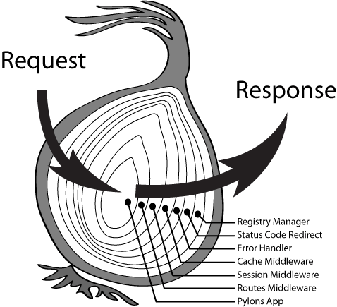

> 本文由 [简悦 SimpRead](http://ksria.com/simpread/) 转码， 原文地址 [juejin.cn](https://juejin.cn/post/6844903602511675405?searchId=20231206013637DD2C6DA796839B262316#heading-3)

### 介绍

在我们日常开发中，越来越多看到了`中间件`这个词，例如 Koa，redux 等。这里就大概记录一下 Koa 和 redux 中间件的实现方式，可以从中看到中间件的实现方式都是大同小异，基本都是实现了洋葱模型。

对于中间件我们需要了解的是

*   中间件是如何存储的
*   中间件是如何执行的

正文
---

### Koa

作为 TJ 大神的作品，真不愧是号称`基于 Node.js 平台的下一代 web 开发框架`，其中对于`中间件`的实现，`generator/yield`, 还是`await/async`, 对于回调地狱的处理，都是给后来的开发者很大的影响。

#### Koa 1 的中间件

##### 存储

```ts
/**
 * https://github.com/Koajs/Koa/blob/1.6.0/lib/application.js
 */

 ...
 var app = Application.prototype;

 function Application() {
  if (!(this instanceof Application)) return new Application;
  this.env = process.env.NODE_ENV || 'development';
  this.subdomainOffset = 2;
  this.middleware = [];
  this.proxy = false;
  this.context = Object.create(context);
  this.request = Object.create(request);
  this.response = Object.create(response);
}

...

app.use = function(fn){
  if (!this.experimental) {
    // es7 async functions are not allowed,
    // so we have to make sure that `fn` is a generator function
    assert(fn && 'GeneratorFunction' == fn.constructor.name, 'app.use() requires a generator function');
  }
  debug('use %s', fn._name || fn.name || '-');
  this.middleware.push(fn);
  return this;
};
```

可以在这里看到我们通过`app.use`加入的中间件，保存在一个`middleware`的数组中。

##### 执行

```ts
/**
 * https://github.com/Koajs/Koa/blob/1.6.0/lib/application.js
 */
app.listen = function(){
  debug('listen');
  var server = http.createServer(this.callback());
  return server.listen.apply(server, arguments);
};

// 删除了一些警告代码
app.callback = function(){
  ...
  var fn = this.experimental
    ? compose_es7(this.middleware)
    : co.wrap(compose(this.middleware));
  var self = this;
  ...
  return function handleRequest(req, res){
    var ctx = self.createContext(req, res);
    self.handleRequest(ctx, fn);
  }
};

app.handleRequest = function(ctx, fnMiddleware){
  ctx.res.statusCode = 404;
  onFinished(ctx.res, ctx.onerror);
  fnMiddleware.call(ctx).then(function handleResponse() {
    respond.call(ctx);
  }).catch(ctx.onerror);
};
```

可以在这里看到`middleware`数组经过一些处理，生成了`fn`，然后通过`fnMiddleware.call(ctx)`传入`ctx`来处理，然后就将`ctx`传给了`respond`, 所以这里的`fnMiddleware`就是我们需要去了解的内容。

这里首先判断是否是`this.experimental`来获取是否使用了`async/await`，这个我们在`Koa1`中不做详细介绍。我们主要是来看一下`co.wrap(compose(this.middleware))`。

让我们先来看一下`compose()`

```ts
/**
 * 这里使用了Koa1@1.6.0 package.json中的Koa-compose的版本
 * https://github.com/Koajs/compose/blob/2.3.0/index.js
 */
function compose(middleware){
  return function *(next){
    if (!next) next = noop();

    var i = middleware.length;

    while (i--) {
      next = middleware[i].call(this, next);
    }

    return yield *next;
  }
}

function *noop(){}
```

`co.wrap(compose(this.middleware))`就变成了如下的样子

```ts
co.wrap(function *(next){
    if (!next) next = noop();

    var i = middleware.length;

    while (i--) {
      next = middleware[i].call(this, next);
    }

    return yield *next;
})
```

我们可以看到这里对`middleware`进行了倒序遍历。`next = middleware[i].call(this, next);`可以写为类似下面这个代码结构

```ts
function *middleware1() {
  ...
  yield function *next1() {
    ...
	yield function *next2() {
	  ...
	  ...
	  ...
	}
	...
  }
  ...
}
```

然后`next = middleware[i].call(this, next);`其实每一个`next`就是一个`middleware`，所以也就可以变成

```ts
function *middleware1() {
  ...
  yield function *middleware2() {
    ...
    yield function *middleware() {
      ...
	  ...
	  ...
	}
	...
  }
  ...
}
```

然后我们就获得了下面这个代码

```ts
co.wrap(function *(next){
  next = function *middleware1() {
    ...
    yield function *middleware2() {
      ...
      yield (function *middleware3() {
        ...
        yield function *() {
          // noop
          // NO next yield !
        }
        ...
      }
      ...
    }
    ...
  }
  return yield *next;
})
```

至此我们来看一眼洋葱模型, 是不是和我们上面的代码结构很想。



现在我们有了洋葱模型式的中间节代码，接下来就是执行它。接下来就是`co.wrap`, 这里我们就不详细说明了，`co`框架就是一个通过`Promise`来让`generator`自执行的框架，实现了类似`async/await`的功能（其实应该说`async/await`的实现方式就是`Promise`和`generator`）。

> 这里提一个最后`yield *next`，是让`code`可以少执行一些，因为如果使用`yield next`，会返回一个迭代器，然后`co`来执行这个迭代器，而`yield *`则是相当于将`generator`里面的内容写在当前函数中，详细可以见 [yield*](https://link.juejin.cn?target=https%3A%2F%2Fdeveloper.mozilla.org%2Fzh-CN%2Fdocs%2FWeb%2FJavaScript%2FReference%2FOperators%2Fyield* "https://developer.mozilla.org/zh-CN/docs/Web/JavaScript/Reference/Operators/yield*")

> 关于 Koa1 可以看我的早一些写的另一篇 [Koa 中间件（middleware）实现探索](https://link.juejin.cn?target=http%3A%2F%2Fwangyuekai.com%2F2017%2F02%2F23%2FKoa-middleware%2F "http://wangyuekai.com/2017/02/23/Koa-middleware/")

#### Koa 2 的中间件

##### 存储

```ts
/**
 * https://github.com/Koajs/Koa/blob/1.6.0/lib/application.js
 */
 ...
 constructor() {
    super();

    this.proxy = false;
    this.middleware = [];
    this.subdomainOffset = 2;
    this.env = process.env.NODE_ENV || 'development';
    this.context = Object.create(context);
    this.request = Object.create(request);
    this.response = Object.create(response);
  }

...

  use(fn) {
    if (typeof fn !== 'function') throw new TypeError('middleware must be a function!');
    if (isGeneratorFunction(fn)) {
      deprecate('Support for generators will be removed in v3. ' +
                'See the documentation for examples of how to convert old middleware ' +
                'https://github.com/Koajs/Koa/blob/master/docs/migration.md');
      fn = convert(fn);
    }
    debug('use %s', fn._name || fn.name || '-');
    this.middleware.push(fn);
    return this;
  }
```

`Koa2`对于`middleware`的存储和`Koa1`基本一模一样，保存在一个数组中。

##### 执行

```ts
callback() {
    const fn = compose(this.middleware);

    if (!this.listeners('error').length) this.on('error', this.onerror);

    const handleRequest = (req, res) => {
      const ctx = this.createContext(req, res);
      return this.handleRequest(ctx, fn);
    };

    return handleRequest;
  }

  /**
   * Handle request in callback.
   *
   * @api private
   */

  handleRequest(ctx, fnMiddleware) {
    const res = ctx.res;
    res.statusCode = 404;
    const onerror = err => ctx.onerror(err);
    const handleResponse = () => respond(ctx);
    onFinished(res, onerror);
    return fnMiddleware(ctx).then(handleResponse).catch(onerror);
```

这里主要就是两行代码

```
const fn = compose(this.middleware);
// fnMiddleware === fn
fnMiddleware(ctx).then(handleResponse).catch(onerror);
```

`Koa2`的代码似乎比`Koa1`要简介一些了，在默认使用`await/async`之后，少了`co`的使用。

从`fnMiddleware(ctx).then(handleResponse).catch(onerror);`我们可以知道`fnMiddleware`返回了一个`Promise`, 然后执行了这个`Promise`，所以我们主要知道`compose`做了什么就好。

```ts
/**
 * https://github.com/Koajs/compose/blob/4.0.0/index.js
 */
function compose (middleware) {
  ...
  return function (context, next) {
    // last called middleware #
    let index = -1
    return dispatch(0)
    function dispatch (i) {
      if (i <= index) return Promise.reject(new Error('next() called multiple times'))
      index = i
      let fn = middleware[i]
      if (i === middleware.length) fn = next
      if (!fn) return Promise.resolve()
      try {
        return Promise.resolve(fn(context, function next () {
          return dispatch(i + 1)
        }))
      } catch (err) {
        return Promise.reject(err)
      }
    }
  }
}
```

看起来这段代码比`Koa1`的`compose`稍微复杂了些，其实差不多，主要的代码其实也就两个

```ts
function compose (middleware) {
  ...
  return function (context, next) {
    let index = -1
    return dispatch(0)
    function dispatch (i) {
      let fn = middleware[i]
      return Promise.resolve(fn(context, function next () {
        return dispatch(i + 1)
      }))
    }
  }
}
```

相比于`Koa1`遍历`middleware`数组，`Koa2`改为了递归。同上面一样，我们可以将函数写为如下结构

```ts
async function middleware1() {
  ...
  await (async function middleware2() {
    ...
    await (async function middleware3() {
      ...
    });
    ...
  });
  ...
}
```

因为`async`函数的自执行，所以直接运行该函数就可以了。

可以看到`Koa1`与`Koa2`的中间件的实现方式基本是一样的，只是一个是基于`generator/yield`， 一个是基于`async/await`。

### Redux

相比于`Koa`的中间件的具体实现，`Redux`相对稍复杂一些。

> 本人对于 Redux 基本没有使用，只是写过一些简单的 demo，看过一部分的源码，如有错误，请指正

##### 存储

我们在使用 Redux 的时候可能会这么写

```ts
// 好高阶的函数啊
const logger = store => next => action => {
  console.group(action.type)
  console.info('dispatching', action)
  let result = next(action)
  console.log('next state', store.getState())
  console.groupEnd(action.type)
  return result
}

let store = createStore(
  todoApp,
  applyMiddleware(
    logger
  )
)
```

我们可以很方便的找到`applyMiddleware`的源码。

```ts
export default function applyMiddleware(...middlewares) {
  return createStore => (...args) => {
    const store = createStore(...args)
    let dispatch = () => {
      throw new Error(
        `Dispatching while constructing your middleware is not allowed. ` +
          `Other middleware would not be applied to this dispatch.`
      )
    }

    const middlewareAPI = {
      getState: store.getState,
      dispatch: (...args) => dispatch(...args)
    }
    const chain = middlewares.map(middleware => middleware(middlewareAPI))
    dispatch = compose(...chain)(store.dispatch)

    return {
      ...store,
      dispatch
    }
  }
}
```

`Redux`没有单独保存`middleware`的地方，但是通过展开符的`...middlewares`，我们也可以知道至少一开始的`middlewares`是一个数组的形式。

#### 执行

执行的代码，还是上面那段代码片段。

我们可以看到`applyMiddleware()`中，对传入的`middlewares`做了简单的封装，目的是为了让每个`middleware`在执行的时候可以拿到当前的一些环境和一些必要的接口函数。也就是上面那个高阶函数`logger`所需要的三个参数`store`,`next`,`action`。

一开始是`middlewares.map(middleware => middleware(middlewareAPI))`，而`middlewareAPI`传入了`getState`和`dispatch`接口（`dispatch`接口暂时没有用）。这一步就实现了上面高阶函数`logger`所需要的参数`store`。

然后是我们看到好多次的`compose`函数，我们找到`compose`函数的实现。

```ts
export default function compose(...funcs) {
  if (funcs.length === 0) {
    return arg => arg
  }

  if (funcs.length === 1) {
    return funcs[0]
  }

  return funcs.reduce((a, b) => (...args) => a(b(...args)))
}
```

我们看到`compose`对传入的中间件函数，通过`Array.reduce`函数处理了一下。最终的函数应该大概类似下面这个格式

```ts
// 加入函数名next方便后面理解
function chain(...args) {
  return () => {
    return a(function next(...args) {
      return b(function next(...args) {
        return c(...args);
      })
    })
  }
}
```

这里已经再次出现了我们熟悉的洋葱模型。同时将下一个组件已参数（`next`）的形式传入当前的中间件，这里就完成了上面的高阶函数`logger`所需要的第二个参数`next`, 在中间件内部调用`next`函数就可以继续中间节的流程。

最后传入了`store.dispatch`也就是高阶函数`logger`所需要的第二个参数`action`，这个就不用多数了，就是将我们刚刚得到的洋葱格式的函数调用一下，通过闭包使得每个中间节都可以拿到`store.dispatch`。

总结
---

至此，`Redux`和`Koa`的中间件的介绍就差不多了，两者都是以数组的形式保存了中间件，执行的时候都是创建了一个类似洋葱模型的函数结构，也都是将一个包裹下一个中间件的函数当做`next`，传入当前中间件，使得当前中间件可以通过调用`next`来执行洋葱模型，同时在`next`执行的前后都可以写逻辑代码。不同的是`Koa1`是通过遍历生成的，`Koa2`是通过递归来生成的，`redux`是通过`reduce`来生成的（和`Koa1`的遍历类似）。

所以中间件其实都基本类似，所以好好的理解了一种中间件的实现方式，其他的学起来就很快了（只是表示前端这一块哦）。